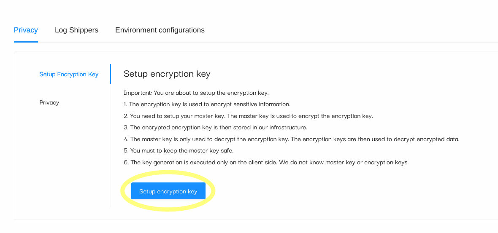
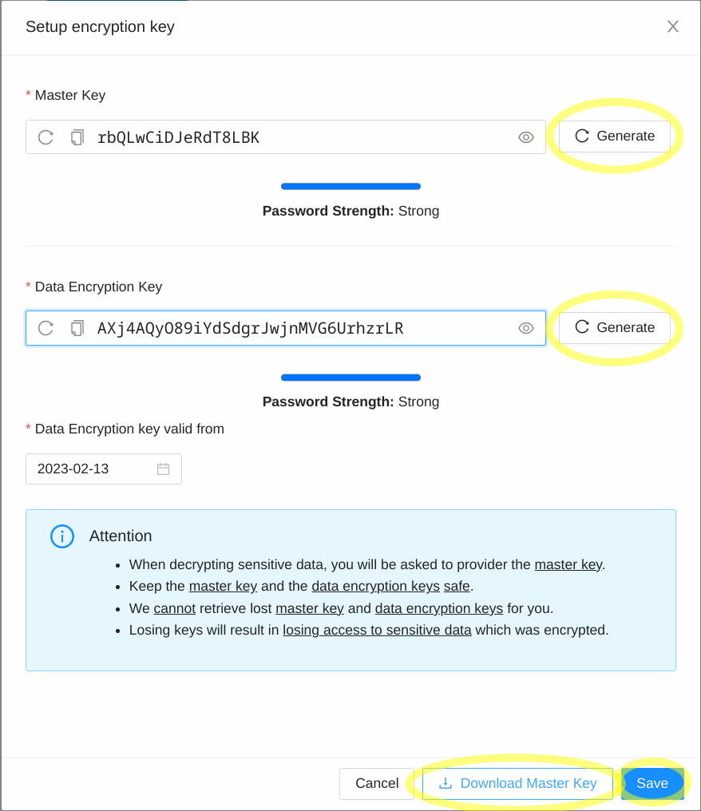
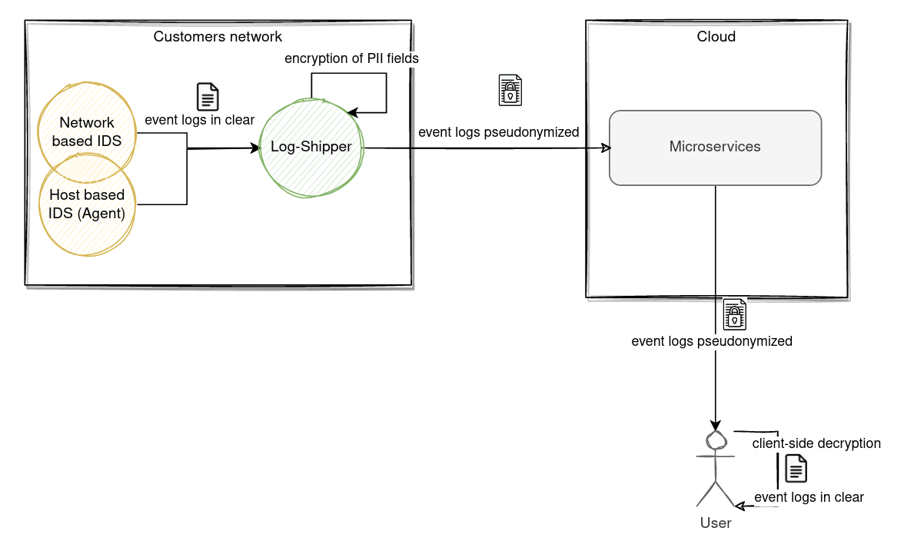

# End-To-End Encryption (E2EE)

We describe how we protect sensitive information with End-To-End Encryption (E2EE). It consists of two main parts.

The first part is the setup part, which is the master key generation only known by the customer or the organization owner.

The second part consists of encrypting sensitive personally identifiable information (PII) whenever the field is matched by the fluent-bit `encrypt` plugin when processing the security event logs.

## Data flow diagram

In this section, we describe how security event logs are encrypted by the log-shipper (i.e. fluent-bit) before they are sent to the cloud via Kafka messaging queue to be processed and persisted.

The owner of the organization knows the master key (secret key) is then able to decrypt sensitive information by providing the master key. At no point is the cloud aware of the master key. All decryptions of sensitive information are computed exclusively on the client side browser.

### First part (setup)

The setup phase must be completed by the owner of the organization right after a new organization has been created. Its accessible through:

* Settings -> Privacy -> Setup Encryption Key view.
* Click on **Setup Encryption Key** button.

<figure markdown>
 
 <figcaption>Figure 1: Setup Encryption Key</figcaption>
</figure>

A new window will appear with three fields to fill in:

* Master Key
* Data Encryption Key
* Data Encryption Key valid date from <date>

<figure markdown>
 
 <figcaption>Figure 2: Generate Master Key and Data Encryption Key</figcaption>
</figure>

### Second part (processing)

The event logs are generated in the customers site by various security agents. These security event logs are stored in files and are read by the log-shipper (i.e. fluent-bit). Fluent-bit processes the event logs and checks for the matching PII fields. Any matching PII field is then encrypted using the data encryption key (DEK) which was generated by the owner of the organization during the setup phase.

Event-logs are shipped to the cloud in pseudonymized format.

<figure markdown>
 
 <figcaption>Figure 3: Data flow diagram</figcaption>
</figure>

### Decryption of PIIs

The decryption of Personal Identifiable Information (PII) occurs exclusively on the clyde site browser. A user is able to decrypt encrypted PII field by providing the valid **Master Key** that he has selected during the setup phase.

## Encryption mechanisms

We support four encryption mechanisms:

* **AES-GCM**: AES-GCM (Galois/Counter Mode) is the standard encryption scheme. It does not preserve the utility or searching capability of the data because every ciphertext is unique.
* **AES-GCM DET**: AES-GCM deterministic. It preserves the searching functionality of the encrypted values but is a weaker form of encryption because the IV is derived from the input message.
* **CryptopANT IPv4/IPv6**: IPv4/IPv6 encryption scheme built on top of open-source CryptopANT encryption algorithm. For more information: [https://ant.isi.edu/software/cryptopANT/index.html](https://ant.isi.edu/software/cryptopANT/index.html)
* **HMAC-SHA256**: HMAC uses the SHA-256 hash function which is a one way function implying that plaintext cannot be decrypted or visible in clear.

The encryption mechanisms source-code is also available on our github page.

## Encryption keys

The encryption keys are generated in the setup phase. At no point is the Master Key shared with the backend server or the cloud. The owner of the organization can decide with whom he wants to share its keys.

The **Master Key** is used to encrypt the **Data Encryption Key** which is a key that is used to encrypt or decrypt the data in clear.

In order for the log-shipper (i.e. fluent-bit) to encrypt sensitive PII fields, the *Master Key* must be specified in the configuration file which is used by the fluent-bit software.

## Privacy by default

Our SIEM platform is pre-configured to encrypt sensitive PII fields for our support security event type logs.